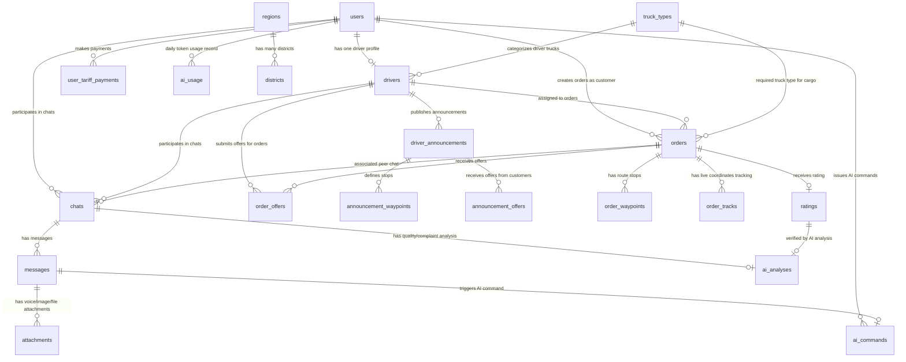

# Logistika AI Platform — Database Architecture

Ushbu hujjat loyihaning ma'lumotlar bazasi arxitekturasi, jadvallar tuzilishi, ustunlar turlari va ularning o'zaro bog'liqliklarini tushuntiradi. Baza PostgreSQL-da ishlaydi va SQLAlchemy (async) ORM orqali boshqariladi.

---

## 1. ER-Diagram (Entity-Relationship)

Quyidagi diagramma jadvallar orasidagi munosabatlarni tasvirlaydi:

---

## 2. Jadvallar Tuzilishi va Tavsifi

### 2.1. Foydalanuvchilar Moduli (Users)

#### `users` jadvali
Foydalanuvchilar va Telegram bot orqali ro'yxatdan o'tgan mijozlar/haydovchilar profili:
- **`id`**: `BigInteger` (Primary Key) — Telegram user ID
- **`username`**: `String(32)` (Nullable) — Telegram username (`t.me/{username}`)
- **`full_name`**: `String(128)` — Ism-familiya
- **`password`**: `String` (Nullable) — Parol (veb admin paneli uchun)
- **`is_active`**: `Boolean` (Default: `true`) — Profil faolligi
- **`is_banned`**: `Boolean` (Default: `false`) — Bloklanganlik holati
- **`language`**: `String(10)` (Default: `'uz'`) — Til sozlamasi (`uz`, `ru`)
- **`role`**: `Enum` (`admin`, `sender`, `driver`, `guest`) — Foydalanuvchi roli
- **`phone_number`**: `String(20)` (Nullable) — Telefon raqami
- **`email`**: `String(100)` (Unique, Nullable) — Elektron pochta
- **`balance`**: `Numeric(10, 2)` (Default: `0.0`) — Virtual hisob balansi
- **`bio`**: `String(500)` (Nullable) — Qo'shimcha ma'lumot

#### `user_tariff_payments` jadvali
Foydalanuvchilarning PRO/Free tarif to'lovlari tarixi:
- **`id`**: `Integer` (Primary Key, Autoincrement)
- **`user_id`**: `BigInteger` (FK -> `users.id`) — To'lovchi foydalanuvchi
- **`billing_month`**: `Date` — Qaysi oy uchun to'langanligi
- **`amount`**: `Numeric(14, 2)` — To'lov miqdori
- **`currency`**: `String(10)` (Default: `'UZS'`) — Pul birligi
- **`tariff_code`**: `String(64)` — Tarif kodi (`free`, `pro`)
- **`paid_at`**: `DateTime` (Nullable) — To'langan sana

---

### 2.2. Haydovchilar Moduli (Driver)

#### `drivers` jadvali
Haydovchilik profili va yuk mashinasi ma'lumotlari:
- **`id`**: `Integer` (Primary Key, Autoincrement)
- **`user_id`**: `BigInteger` (FK -> `users.id`, Unique) — Tegishli foydalanuvchi akkaunti
- **`truck_type_id`**: `Integer` (FK -> `truck_types.id`) — Yuk mashinasi turi
- **`truck_number`**: `String(20)` (Unique) — Mashina davlat raqami
- **`truck_year`**: `SmallInteger` (Nullable) — Chiqarilgan yili
- **`current_city` / `current_region`**: `String` — Hozirgi joylashgan shahri/viloyati
- **`is_live_location_active`**: `Boolean` (Default: `false`) — Can GPS track?
- **`live_location_expires`**: `DateTime` — GPS tracking muddati tugashi
- **`last_latitude` / `last_longitude`**: `Float` — Oxirgi GPS kordinatalari
- **`last_location_at`**: `DateTime` — Oxirgi GPS yangilangan vaqti
- **`rating`**: `Numeric(3, 2)` (Default: `5.0`) — Reyting
- **`total_trips`**: `Integer` (Default: `0`) — Jami safarlar soni
- **`cancel_count`**: `Integer` (Default: `0`) — Bekor qilingan buyurtmalar soni
- **`total_km`**: `Integer` (Default: `0`) — Jami bosib o'tgan masofa
- **`on_time_percent`**: `Numeric(5, 2)` (Default: `100.0`) — O'z vaqtida yetib borish koeffitsiyenti
- **`is_available`**: `Boolean` (Default: `true`) — Bo'sh / Band holati
- **`docs_verified`**: `Boolean` (Default: `false`) — Hujjatlari tasdiqlanganmi
- **`is_blocked`**: `Boolean` (Default: `false`) — Bloklanganmi
- **`block_reason`**: `String(300)` (Nullable) — Bloklanish sababi

#### `truck_types` jadvali
Yuk mashinalari klassifikatsiyasi (masalan: Tent, Refrijerator, Bortli):
- **`id`**: `Integer` (Primary Key, Autoincrement)
- **`name`**: `String(50)` (Unique) — Nomi
- **`max_weight`**: `Numeric(6, 2)` — Maksimal yuk ko'tarish (tonna)
- **`max_volume`**: `Numeric(6, 2)` — Maksimal hajm (m³)
- **`length` / `width` / `height`**: `Numeric(5, 2)` (Nullable) — O'lchamlari
- **`pallet_capacity`**: `Integer` (Nullable) — Palletlar soni
- **`image_url`**: `String(512)` (Nullable) — Mashina turi ikonkasi url
- **`is_active`**: `Boolean` (Default: `true`) — Faol / No-faol

#### `driver_announcements` jadvali
Haydovchining bo'sh ketayotgan yo'nalishi va yuk olish e'loni:
- **`id`**: `Integer` (Primary Key, Autoincrement)
- **`driver_id`**: `Integer` (FK -> `drivers.id`)
- **`total_distance_km`**: `Numeric(8, 2)` — Marshrut masofasi
- **`price`**: `Numeric(12, 2)` — Kutilayotgan narx
- **`currency`**: `String(10)` (Default: `'UZS'`)
- **`available_weight` / `available_volume`**: `Numeric(6, 2)` — Qolgan bo'sh og'irlik va hajm
- **`departure_date` / `arrival_date`**: `DateTime` — Yo'lga chiqish va yetib borish vaqti
- **`status`**: `Enum` (`active`, `filled`, `expired`, `cancelled`)

#### `announcement_waypoints` jadvali
Haydovchi e'lonining marshrut to'xtash nuqtalari:
- **`id`**: `Integer` (Primary Key, Autoincrement)
- **`announcement_id`**: `Integer` (FK -> `driver_announcements.id`)
- **`sequence`**: `SmallInteger` — Tartib raqami (0-origin, 1-transit...)
- **`waypoint_type`**: `Enum` (`origin`, `destination`, `transit`)
- **`city` / `region` / `address`**: `String` — Manzil tafsilotlari
- **`latitude` / `longitude`**: `Numeric(10, 7)` — GPS kordinatalari

#### `announcement_offers` jadvali
Mijozlar tomonidan haydovchining e'loniga berilgan yuk tashish takliflari:
- **`id`**: `Integer` (Primary Key, Autoincrement)
- **`announcement_id`**: `Integer` (FK -> `driver_announcements.id`)
- **`customer_id`**: `BigInteger` (FK -> `users.id`) — Yuk egasi
- **`cargo_name`**: `String(200)` — Yuk nomi
- **`cargo_weight` / `cargo_volume`**: `Numeric(6, 2)` — Yuk og'irligi/hajmi
- **`pickup_city` / `delivery_city`**: `String` — Qayerdan qayergacha
- **`offered_price`**: `Numeric(12, 2)` — Mijoz taklif qilgan narx
- **`counter_price`**: `Numeric(12, 2)` (Nullable) — Haydovchi qarshi taklif qilgan narx
- **`status`**: `Enum` (`pending`, `seen`, `accepted`, `rejected`, `cancelled`, `expired`, `outbid`)

---

### 2.3. Buyurtmalar Moduli (Order & Geo)

#### `regions` va `districts` jadvallari
O'zbekistonning geografik chegaralari (GeoJSON formatda saqlanadi):
- **`regions`**: `id`, `soato_id`, `name_uz`/`name_ru`, `centroid_lat`, `centroid_lng`, `bounds` (JSON), `geojson` (JSON)
- **`districts`**: `id`, `region_id` (FK -> `regions.id`), `soato_id`, `name_uz`/`name_ru`, `centroid_lat`, `centroid_lng`, `bounds` (JSON), `geojson` (JSON)

#### `orders` jadvali
Mijoz yuk buyurtmasi:
- **`id`**: `Integer` (Primary Key, Autoincrement)
- **`customer_id`**: `BigInteger` (FK -> `users.id`) — Yuk egasi
- **`driver_id`**: `Integer` (FK -> `drivers.id`, Nullable) — Tayinlangan haydovchi
- **`cargo_name`**: `String(200)` — Yuk nomi
- **`weight` / `volume`**: `Numeric(6, 2)` — Og'irligi (tonna) va hajmi (m³)
- **`total_distance_km`**: `Numeric(8, 2)` — Marshrut masofasi
- **`required_truck_type_id`**: `Integer` (FK -> `truck_types.id`) — Kerakli mashina turi
- **`price`**: `Numeric(12, 2)` — Narxi
- **`currency`**: `String(10)` (Default: `'UZS'`)
- **`status`**: `Enum` (`PENDING`, `ACCEPTED`, `IN_PROGRESS`, `COMPLETED`, `CANCELLED`)
- **`scheduled_start` / `scheduled_end`**: `DateTime` — Yuklash va yetkazish rejalashtirilgan vaqti

#### `order_waypoints` jadvali
Buyurtmaning yuk olish, yuk tushirish va oraliq nuqtalari yo'nalishi:
- **`id`**: `Integer` (Primary Key, Autoincrement)
- **`order_id`**: `Integer` (FK -> `orders.id`)
- **`sequence`**: `SmallInteger` — Marshrutdagi tartibi
- **`waypoint_type`**: `Enum` (`PICKUP`, `DELIVERY`, `TRANSIT`)
- **`status`**: `Enum` (`PENDING`, `ARRIVED`, `COMPLETED`, `SKIPPED`)
- **`city` / `region` / `address`**: `String` — Manzil ma'lumotlari
- **`latitude` / `longitude`**: `Numeric(10, 7)` — Kordinatalar

#### `order_offers` jadvali
Haydovchilar tomonidan buyurtmalarga yuborilgan narx va vaqt takliflari:
- **`id`**: `Integer` (Primary Key, Autoincrement)
- **`order_id`**: `Integer` (FK -> `orders.id`)
- **`driver_id`**: `Integer` (FK -> `drivers.id`)
- **`offered_price`**: `Numeric(12, 2)` — Haydovchi taklif qilgan narx
- **`estimated_pickup_time` / `estimated_delivery_time`**: `DateTime` — Rejalashtirilgan vaqti
- **`distance_to_pickup_km`**: `Numeric(7, 2)` — Haydovchining yuklashgacha bo'lgan masofasi
- **`status`**: `Enum` (`pending`, `seen`, `accepted`, `rejected`, `cancelled`, `expired`, `outbid`)

#### `order_tracks` jadvali
Buyurtma davomida haydovchining harakatlanish tarixi (live-location track log):
- **`id`**: `Integer` (Primary Key, Autoincrement)
- **`order_id`**: `Integer` (FK -> `orders.id`)
- **`latitude` / `longitude`**: `Numeric(10, 7)`
- **`speed`**: `Float` — Tezlik (km/s)
- **`recorded_at`**: `DateTime` — Ro'yxatga olingan vaqt

---

### 2.4. Suhbat va Sun'iy Intelekt Moduli (Chat & AI)

#### `chats` jadvali
Sender (mijoz) va Haydovchi o'rtasidagi peer chat yoki AI Yordamchi suhbat sessiyasi:
- **`id`**: `Integer` (Primary Key, Autoincrement)
- **`user_id`**: `BigInteger` (FK -> `users.id`, Nullable) — Mijoz
- **`driver_id`**: `Integer` (FK -> `drivers.id`, Nullable) — Haydovchi
- **`order_id`**: `Integer` (FK -> `orders.id`, Unique, Nullable) — Qaysi buyurtma bo'yicha ekanligi
- **`category`**: `Enum` (`complaint`, `suggestion`, `conversation`, `ai_command`, `support`) — Chat turi
- **`status`**: `Enum` (`open`, `resolved`, `pending`, `escalated`) — Chat holati
- **`title`**: `String(255)` (Nullable) — Suhbat nomi

#### `messages` jadvali
Suhbat ichidagi xabarlar:
- **`id`**: `Integer` (Primary Key, Autoincrement)
- **`chat_id`**: `Integer` (FK -> `chats.id`)
- **`sender_id`**: `BigInteger` (Nullable) — Yuboruvchi user ID
- **`sender_type`**: `Enum` (`user`, `driver`, `ai`, `system`) — Yuboruvchi turi
- **`message_type`**: `Enum` (`text`, `voice`, `image`, `video`, `file`, `system`, `ai_reply`)
- **`content`**: `Text` (Nullable) — Xabar matni
- **`is_read`**: `Boolean` (Default: `false`) — O'qilganlik holati
- **`ai_sentiment`**: `Float` (Nullable) — AI tomonidan aniqlangan hissiy ohang (sentiment score)
- **`ai_flagged`**: `Boolean` (Default: `false`) — AI shubhali yoki qoidalarga zid deb belgilaganmi
- **`ai_flag_reason`**: `String(255)` (Nullable) — Qoidalarga zid deb topilgan sababi

#### `attachments` jadvali
Xabarlarga biriktirilgan rasm, video, audio yoki hujjat fayllari:
- **`id`**: `Integer` (Primary Key, Autoincrement)
- **`message_id`**: `Integer` (FK -> `messages.id`)
- **`file_type`**: `Enum` (`image`, `video`, `voice`, `file`)
- **`file_url`**: `String(512)` — Fayl yuklangan url manzili
- **`original_name` / `mime_type`**: `String`
- **`file_size`**: `BigInteger` (Bytes)
- **`transcript`**: `Text` (Nullable) — Ovozli xabarlar uchun AI yordamida matnga aylantirilgan variant (audio transcript)

#### `ratings` jadvali
Buyurtma tugallangandan keyingi o'zaro baholash reytingi va shikoyatlar:
- **`id`**: `Integer` (Primary Key, Autoincrement)
- **`order_id`**: `Integer` (FK -> `orders.id`)
- **`rated_by_user` / `rated_by_driver`**: Baholovchi
- **`target_type`**: `Enum` (`user`, `driver`) — Baholangan taraf turi
- **`target_user` / `target_driver`**: Baholangan taraf
- **`score`**: `Integer` — Baho (1-5)
- **`comment`**: `Text` (Nullable) — Baho izohi
- **`ai_sentiment_score`**: `Float` — Baho ohangi balli
- **`ai_verdict`**: `Enum` (`valid`, `invalid`, `partial`, `uncertain`) — Shikoyat/Bahoning haqqoniyligi bo'yicha AI xulosasi
- **`is_suspicious`**: `Boolean` (Default: `false`) — Shubhali (firibgarlik yoki kelishilgan reyting oshirish) deb topilganmi

#### `ai_analyses` jadvali
Chat yoki Reytinglar bo'yicha sun'iy intellektning chuqurroq tahlillari:
- **`id`**: `Integer` (Primary Key, Autoincrement)
- **`chat_id` / `rating_id`**: Tahlil obyekti
- **`analysis_type`**: `Enum` (`chat_review`, `complaint_verify`, `sentiment`, `rating_verify`)
- **`summary`**: `Text` — AI tayyorlagan qisqacha xulosa
- **`confidence`**: `Float` — Xulosa ishonchliligi (0.0 - 1.0)
- **`detected_issues`**: `JSON` — Aniqlangan muammolar yoki qonunbuzarliklar ro'yxati

#### `ai_commands` jadvali
Telegram bot yoki Veb-ilovada foydalanuvchilar tomonidan AI ga berilgan matnli buyruqlar (AI commands log):
- **`id`**: `Integer` (Primary Key, Autoincrement)
- **`message_id`**: `Integer` (FK -> `messages.id`, Nullable)
- **`user_id`**: `BigInteger` (FK -> `users.id`)
- **`command_type`**: `Enum` (`find_order`, `track_order`, `cancel_order`, `get_rating`, `get_history`, `contact_support`, `custom`)
- **`parameters`**: `JSON` — AI matndan ajratib olgan parametrlari
- **`status`**: `Enum` (`pending`, `running`, `success`, `failed`)
- **`result`**: `JSON` — Buyruq bajarilish natijasi

#### `ai_usage` jadvali
Har bir foydalanuvchining kunlik AI so'rovlari va token sarfi limiti:
- **`id`**: `Integer` (Primary Key, Autoincrement)
- **`user_id`**: `BigInteger` (FK -> `users.id`)
- **`usage_date`**: `Date` — Kun sanasi
- **`requests`**: `Integer` (Default: `0`) — So'rovlar soni
- **`input_tokens` / `output_tokens`**: `Integer` — Kunlik kirish/chiqish tokenlari soni
