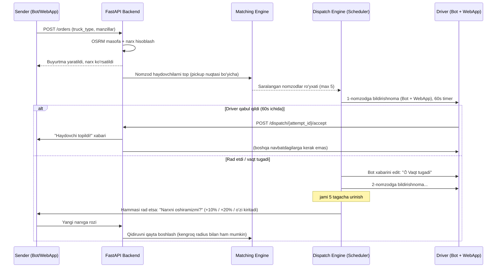

# Avtomatik Dispatch Tizimi — Arxitektura Rejasi

> Holat: LOYIHA (implementatsiyadan oldingi kelishuv hujjati)
> Muallif: Claude (senior arxitektura tahlili), loyihaning joriy kod bazasi asosida
> Sana: 2026-07-16

---

## 1. Nima o'zgardi

Eski model: haydovchi/mijoz **e'lon** qo'yadi, ikkinchi taraf **taklif (offer)** yuboradi, narx muzokara qilinadi (marketplace/bidding).

> Eslatma: kodni tekshirganimda `order_offers`, `driver_announcements`, `announcement_offers` jadvallari **hozirgi kodda umuman yo'q** (`order/models.py`, `driver/models.py`) — faqat eski README'dagi ER-diagrammada qolgan. Demak sizning yangi talabingiz kodning joriy holatiga allaqachon mos — bu yaxshi, orqaga qaytariladigan narsa yo'q.

Yangi model — **avtomatik dispatch** (Uber/Bolt/Yandex tipidagi):

1. Sender (mijoz) kerakli mashina turini va manzillarni kiritadi.
2. Tizim marshrut masofasini (OSRM) hisoblab, **o'rtacha narxni o'zi belgilaydi**.
3. Tizim 1-manzilga (pickup) eng yaqin/mos haydovchini topadi va navbat bilan taklif yuboradi.
4. Har bir haydovchida javob berish uchun **60 soniya** bor.
5. Rad etsa / javob bermasa → keyingi nomzodga o'tiladi. Jami **3–5 tagacha** haydovchi urinib ko'riladi.
6. Hech kim qabul qilmasa → senderga narxni oshirish taklif qilinadi, keyin qidiruv qayta boshlanadi.
7. Bildirishnoma **ikki kanalga** bir vaqtda yuboriladi: Telegram bot xabari (inline tugmalar bilan) **va** shu botga ulangan Web App (Telegram Mini App) — Yandex uslubidagi "jiringlash" effekti bilan.

---

## 2. Foydalanuvchi oqimi (End-to-end)



---

## 3. Ma'lumotlar bazasi o'zgarishlari

### 3.1 Yangi jadval: `dispatch_attempts`

Har bir buyurtma uchun har bir haydovchiga yuborilgan taklif urinishi shu yerda loglanadi (audit + timer boshqaruvi uchun ham kerak).

| Ustun | Tur | Izoh |
|---|---|---|
| `id` | Integer PK | |
| `order_id` | FK → `orders.id` | |
| `driver_id` | FK → `drivers.id` | |
| `round_number` | SmallInteger | 1..5 — nechanchi urinish |
| `match_type` | Enum(`gps`, `region`, `district`) | nomzod qanday topilgani (auditda foydali) |
| `distance_km` | Numeric(6,2) nullable | pickup nuqtasigacha masofa (GPS bo'lsa) |
| `status` | Enum(`pending`, `accepted`, `rejected`, `expired`, `cancelled`) | |
| `sent_at` | DateTime | |
| `expires_at` | DateTime | `sent_at + 60s` |
| `responded_at` | DateTime nullable | |
| `bot_chat_id` | BigInteger nullable | xabarni edit qilish uchun |
| `bot_message_id` | BigInteger nullable | xabarni edit qilish uchun |

Индекс: `(order_id, status)`, `(driver_id, status)`, `(expires_at)` — expired urinishlarni tez topish uchun.

### 3.2 `orders` jadvaliga qo'shimcha ustunlar

- `dispatch_round`: Integer, default 0 — qancha haydovchi allaqachon urinib ko'rilgan
- `price_bump_requested_at`: DateTime nullable — senderga narx oshirish so'ralgan payt
- `original_price`: Numeric(12,2) nullable — tizim boshida hisoblagan narx (keyin `price` oshirilsa ham tarix qolsin)

`OrderStatus` enumiga yangi qiymat qo'shish shart emas — `PENDING` allaqachon "haydovchi qidirilmoqda" degan ma'noni bildiradi (modeldagi izohda shunday yozilgan). Faqat `dispatch_round` va `dispatch_attempts` orqali qaysi bosqichda ekanini bilamiz.

### 3.3 Yangi jadval: `pricing_rules` (agar hali yo'q bo'lsa — tekshirish kerak)

| Ustun | Tur | Izoh |
|---|---|---|
| `id` | Integer PK | |
| `truck_type_id` | FK → `truck_types.id` | |
| `base_price` | Numeric(12,2) | boshlang'ich narx |
| `price_per_km` | Numeric(10,2) | km boshiga narx |
| `min_price` | Numeric(12,2) | pastki chegara |
| `currency` | String(10) | default `UZS` |

Narx formulasi (MVP): `price = base_price + price_per_km * total_distance_km`, `max(price, min_price)` bilan.

### 3.4 `drivers` jadvaliga tavsiya (aniqlik uchun)

Hozir `current_region`/`current_city` — erkin matn (`String`). Bu region-fallback matching uchun ishonchsiz (yozilish xatolari, "Toshkent" vs "Toshkent shahri"). Tavsiya:
- `current_region_id`: FK → `regions.id` (nullable)
- `current_district_id`: FK → `districts.id` (nullable)

Bular driver profilni to'ldirganda dropdown orqali tanlansin (erkin matn emas), shunda region/district bo'yicha SQL `WHERE` aniq ishlaydi.

---

## 4. Nomzod haydovchini tanlash algoritmi (Matching Engine)

**Filtr (har doim):**
```
Driver.is_available = True
AND Driver.is_blocked = False
AND Driver.docs_verified = True
AND Driver.truck_type_id = order.required_truck_type_id
AND Driver.id NOT IN (shu order uchun avval rad etgan/expired bo'lgan driverlar)
```

**Ikki qatlamli qidiruv (Tier):**

- **Tier A — Live GPS (eng aniq):** `services/live_location.py`dagi Redis'dan `is_gps_live=True` haydovchilar ro'yxati olinadi (`get_all_online_drivers()`), pickup koordinatasigacha Haversine/PostGIS masofa hisoblanadi, eng yaqinidan boshlab saralanadi.
- **Tier B — Region/District mos kelishi (fallback):** GPS live bo'lmagan, lekin `current_region_id`/`current_district_id` pickup manzili bilan bir xil bo'lgan haydovchilar, `Driver.reliability_score` (mavjud `hybrid_property`, `driver/models.py:139`) bo'yicha kamayish tartibida saralanadi.

**Birlashtirish:** Tier A to'liq ustuvor (masofasi aniq), keyin Tier B. Yakuniy ro'yxatdan birinchi **5 tasi** olinadi → `dispatch_attempts` ga navbat sifatida yoziladi.

> Nega ikki qatlam kerak: real loyihada barcha haydovchilar doim GPS uzatib turmaydi (batareya, ilova yopiq va h.k.). Faqat GPS'ga tayansak, ko'p holatda "nomzod topilmadi" bo'lib qoladi. Region fallback — ishonchlilik uchun zarur.

---

## 5. Dispatch Engine (Timer/Navbat boshqaruvi)

Bu qismning texnik yechimi eng muhim arxitektura qarori:

**Tavsiya: APScheduler (AsyncIOScheduler) + Redis job store**

- Har bir `dispatch_attempts` yozuvi yaratilganda, `expires_at` vaqtiga APScheduler orqali bitta **delayed job** rejalashtiriladi (`run_date=expires_at`).
- Job ishga tushganda: agar attempt hali `pending` bo'lsa → `expired` deb belgilanadi, bot xabari `"⏱ Vaqt tugadi"` ga edit qilinadi (`bot.edit_message_text`/`edit_message_reply_markup` orqali, tugmalar olib tashlanadi), va **keyingi nomzodga** dispatch qilinadi.
- Agar driver 60s ichida qabul/rad qilsa — API endpoint job'ni **bekor qiladi** (`scheduler.remove_job`) va darhol keyingi logikani chaqiradi (kutish shart emas).
- Redis job store tanlanishi sababi: bot/API qayta ishga tushsa ham (deploy, crash) rejalashtirilgan job'lar yo'qolmaydi — bu productionda muhim, chunki 60s timeout aniq ishlashi kerak.

**Nega Celery emas:** loyiha allaqachon aiogram+FastAPI asosida single-process async arxitekturaga qurilgan (Redis faqat pub/sub va cache uchun ishlatiladi, alohida worker/broker yo'q). APScheduler shu arxitekturaga tabiiy qo'shiladi, Celery esa alohida worker process, broker konfiguratsiyasi va operatsion murakkablik qo'shadi — hozirgi masshtab uchun ortiqcha.

**Muqobil (kelajakda, agar yuk oshsa):** Redis TTL + keyspace notification (`notify-keyspace-events Ex`) — key expire bo'lganda event kelib, worker darhol reaksiya qiladi, polling shart emas. Bu ko'proq gorizontal scale qilish kerak bo'lganda (bir nechta backend instance) foydali, chunki job APScheduler'da bitta process xotirasida emas, Redis'da markazlashgan bo'ladi.

---

## 6. Bildirishnoma tizimi — Dual channel (Bot + WebApp)

Sizning talabingiz: bitta buyurtma kelganda **ikkita joyga** bir vaqtda yuboriladi.

### 6.1 Telegram Bot xabari

- `aiogram` orqali `InlineKeyboardMarkup`: `✅ Qabul qilish` / `❌ Rad etish` tugmalari, `callback_data` da `attempt_id` kodlangan.
- Xabar matnida: yuk turi, manzil (pickup), taxminiy narx, masofa, va **qolgan vaqt** (masalan progress-bar emoji yoki oddiy son).
- 60s tugaganda (yoki driver javob berganda) — xabar **edit** qilinadi (o'chirilmaydi, chunki tarixda qolishi kerak): `"⏱ Vaqt tugadi — buyurtma boshqa haydovchiga yuborildi"`, tugmalar olib tashlanadi.
- Bu logika **botning o'zida ham** (aiogram callback handler) amalga oshiriladi — ya'ni driver botdan ham to'g'ridan-to'g'ri qabul qila oladi (WebApp ochmasdan), aynan siz aytganidek.

### 6.2 Web App (Telegram Mini App)

- WebApp allaqachon loyihada bor (`WEBAPP_URL`, JWT auth — `users/auth.py`, `driver/router.py`dagi WS pattern).
- Real-time push uchun: `driver/router.py`dagi `ws/location` kabi yangi WebSocket endpoint — `ws/dispatch/{driver_id}` (yoki mavjud `ai/chat_ws` patterniga o'xshash).
- WebApp ochiq bo'lganda: yangi dispatch kelsa WebSocket orqali darhol push qilinadi → frontend **ovoz chalinadi** (Yandex uslubida jiringlash, `Audio` API) + `Telegram.WebApp.HapticFeedback` orqali tebranish + countdown UI (60→0).
- WebApp yopiq bo'lsa: faqat bot xabari yetadi (Telegram push notification orqali avtomatik keladi) — WebApp qayta ochilganda joriy dispatch holatini `GET /dispatch/active` orqali sinxronlab oladi.

### 6.3 Ikki kanal orasidagi muvofiqlashtirish (muhim!)

Ikkala kanaldan **birortasida** driver "Qabul qilish"ni bossa — ikkinchisi ham darhol bekor qilinishi kerak (aks holda ikki marta bosilsa xato chiqadi). Buning uchun:
- Backend'da bitta **atomik operatsiya** (`SELECT ... FOR UPDATE` yoki Redis `SETNX` lock) — birinchi kelgan so'rov g'olib, ikkinchisi `409 Conflict` / `"allaqachon javob berilgan"` qaytaradi.
- Qabul qilingandan keyin backend WebSocket orqali WebApp'ga, va bot orqali xabarni edit qilib ("✅ Siz qabul qildingiz") ikkala kanalni ham yopadi.

---

## 7. Narxni oshirish oqimi (Price Escalation)

Barcha 3-5 nomzod rad etsa/vaqt tugasa:

1. `order.dispatch_round >= MAX_ROUNDS (5)` va oxirgi urinish `expired`/`rejected` bo'lsa → sender'ga ikkala kanalga ham xabar: *"Hozircha haydovchi topilmadi. Narxni oshiramizmi?"* tugmalar: `+10%`, `+20%`, `O'zim kiritaman`, `Kutib turaman`.
2. Sender narxni tasdiqlasa → `order.price` yangilanadi, `dispatch_round` = 0 ga qaytariladi (yoki davom ettiriladi — biznes qaroriga bog'liq), qidiruv **qayta boshlanadi** — bu safar radius/qidiruv doirasini kengaytirish ham mumkin (masalan qo'shni tumanlarni ham qo'shish).
3. Sender "Kutib turaman" desa — buyurtma `PENDING` holatda qoladi, tizim fon rejimida (masalan har 5 daqiqada) qayta urinib ko'radi (yangi GPS onlayn haydovchi chiqishi mumkin).

---

## 8. Yangi/o'zgargan API va Bot handlerlar

**FastAPI (yangi router: `order/dispatch_router.py` tavsiya qilinadi):**
- `POST /orders` — sender buyurtma yaratadi (narx avtomatik hisoblanadi, dispatch avtomatik boshlanadi)
- `POST /dispatch/{attempt_id}/accept` — driver qabul qiladi (WebApp'dan)
- `POST /dispatch/{attempt_id}/reject` — driver rad etadi (WebApp'dan)
- `GET /dispatch/active` — driver WebApp ochganda joriy faol taklifni sinxronlash uchun
- `POST /orders/{id}/price-bump` — sender narxni oshiradi
- `WS /ws/dispatch/{driver_id}` — real-time push (yangi taklif, bekor qilinishi)

**aiogram (bot):**
- `handlers/dispatch.py` (yangi fayl) — `CallbackQuery` handlerlar: `dispatch:accept:{attempt_id}`, `dispatch:reject:{attempt_id}` — xuddi shu backend funksiyalarini chaqiradi (kod takrorlanmasligi uchun umumiy `services/dispatch_service.py` orqali).

---

## 9. Texnologiyalar

| Qatlam | Texnologiya | Holat |
|---|---|---|
| Bot | aiogram 3.26 | ✅ mavjud |
| Backend API | FastAPI | ✅ mavjud |
| DB | PostgreSQL + PostGIS, SQLAlchemy async | ✅ mavjud |
| Live GPS | Redis (key TTL + pub/sub) | ✅ mavjud, dispatch uchun qayta ishlatiladi |
| Marshrut/masofa | OSRM (self-hosted, `.osrm` fayllar) | ✅ mavjud |
| **Timer/Scheduler** | **APScheduler (AsyncIOScheduler, RedisJobStore)** | 🆕 qo'shiladi |
| WebApp real-time push | FastAPI WebSocket (`driver/router.py` patterni) | 🆕 yangi endpoint |
| WebApp UI | Telegram Mini App (JS/React — mavjud stack qanday bo'lsa) | mavjud loyihaga bog'lab qo'shiladi |
| Migratsiyalar | Alembic | ⚠️ hozir `Base.metadata.create_all` ishlatilyapti, migratsiya fayllari yo'q — yangi jadvallar uchun birinchi haqiqiy Alembic migratsiyasini yozish tavsiya qilinadi |

---

## 10. Bosqichlar (Roadmap)

**1-bosqich — Ma'lumotlar bazasi va narx hisoblash**
- [ ] `dispatch_attempts`, `pricing_rules` jadvallari + Alembic migratsiyasi
- [ ] `orders`ga `dispatch_round`, `original_price` ustunlari
- [ ] Narx hisoblash servisi (`services/pricing.py`): OSRM masofa + tarif

**2-bosqich — Matching Engine**
- [ ] `services/matching.py`: Tier A (Redis GPS) + Tier B (region/district) nomzod tanlash
- [ ] `drivers.current_region_id`/`current_district_id` FK (region matching aniqligi uchun)

**3-bosqich — Dispatch Engine**
- [ ] APScheduler integratsiyasi (`config/scheduler.py`)
- [ ] Cascade logika: navbat bilan yuborish, 60s timeout, keyingi nomzod

**4-bosqich — Bildirishnomalar**
- [ ] Bot: inline tugmalar + xabarni edit qilish logikasi
- [ ] WebApp: `ws/dispatch` endpoint + frontend push/ovoz/vibratsiya
- [ ] Ikki kanal orasida race-condition himoyasi (lock)

**5-bosqich — Narx oshirish oqimi**
- [ ] Barcha nomzod tugagach sender'ga bildirishnoma
- [ ] `price-bump` endpoint + qayta dispatch

**6-bosqich — Admin monitoring**
- [ ] Admin panelda dispatch holati ko'rinishi (qaysi buyurtma, nechanchi urinishda, qaysi haydovchilarga yuborilgan)

---

## 11. Yirik platformalar bilan taqqoslash

Bu — **Uber/Bolt/Yandex.Cargo**ning klassik **sequential dispatch (cascade)** modeli:
- Narxni tizim belgilaydi (Uber kabi, ochiq bidding emas)
- Eng yaqin/mos haydovchiga birma-bir taklif (Uber "driver matching queue")
- Hech kim rozi bo'lmasa narx oshirish — Uber'ning **surge pricing** g'oyasiga o'xshash, lekin avtomatik emas, sender tasdiqlashi orqali (bu InDrive'dagi "narxni o'zgartirish" bilan Uber'ning avtomatik surge'i orasidagi gibrid yechim — kichik/o'rta bozor uchun mantiqan to'g'ri, chunki avtomatik surge sender'ni hayron qoldirishi mumkin).

---

## 12. Ochiq savollar (implementatsiyadan oldin hal qilinishi kerak)

1. Rad etilgan/expired bo'lgan urinishlardan keyin, agar 5 tadan keyin ham hech kim topilmasa va sender narxni oshirsa — **radius ham kengaytiriladimi** (masalan qo'shni tumanlar) yoki faqat narx oshadimi?
2. 60 soniya — bot va WebApp uchun **bir xil timer**mi, yoki har biri mustaqil hisoblanadimi (WebApp frontendda mahalliy countdown, backend orqali sinxronlanadi)?
3. Driver bir vaqtning o'zida bir nechta dispatch taklifini olishi mumkinmi (parallel buyurtmalar), yoki band bo'lsa umuman nomzodlar ro'yxatiga kirmaydimi? (`is_available` flag bilan hal qilingandek ko'rinadi, lekin "band bo'lish" qachon avtomatik `False` bo'lishini aniqlashtirish kerak.)

---

**Keyingi qadam:** ushbu rejani tasdiqlasangiz, 1-bosqichdan (DB + Alembic migratsiya + narx hisoblash) boshlab, bosqichma-bosqich implementatsiya qilamiz.
