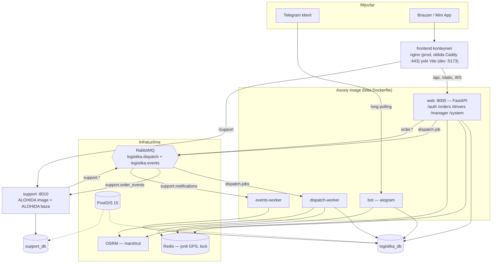

# Logistika platformasi — umumiy hujjat

Bu fayl butun loyihani bir joyda tushuntiradi: qanday xizmatlar bor, ular bir-biriga
qanday ulangan, ma'lumot qayerdan qayerga oqadi va frontend qaysi endpointni chaqiradi.

Chuqurroq mavzular alohida fayllarda:

| Fayl | Nima haqida |
|---|---|
| `docs/MICROSERVICES.md` | Menejer roli, support xizmati va RabbitMQ — backend tomoni, curl misollari bilan |
| `docs/DISPATCH_SYSTEM_PLAN.md` | Avtomatik haydovchi qidirish (dispatch) tizimining dizayni |
| `docs/TECH_RECOMMENDATIONS.md` | Texnik qarz va tavsiyalar |
| `docs/SYSTEM_DESIGN.md` | Eski "as-is" suratlar (qisman eskirgan — ziddiyat bo'lsa shu fayl ustun) |

---

## 1. Loyiha nima qiladi

Yuk tashish platformasi. Uch xil foydalanuvchi:

- **Sender** — yuk beruvchi. Buyurtma yaratadi, narxni ko'radi, haydovchini kuzatadi.
- **Haydovchi** — liniyaga chiqadi, taklif oladi, marshrut nuqtalarini bosib boradi.
- **Xodim** — **admin** (hamma narsa, moliya ham) va **menejer** (buyurtmalar, moliyasiz).

Ikki kirish nuqtasi: **Telegram bot** (aiogram) va **Telegram Mini App** (React SPA).
Ikkalasi ham bir xil backendga boradi.

---

## 2. Xizmatlar ro'yxati

**Muhim tushuncha:** loyihada papkalar ko'p, lekin ularning hammasi alohida server emas.

### 2.1 Bitta katta app (`web`) — "monolit yadro"

Quyidagi papkalar **alohida xizmat EMAS**, ular bitta FastAPI app ichidagi routerlar
(`config/main.py:107-124` da ro'yxatdan o'tkaziladi):

| Papka | Prefiks | Nima qiladi |
|---|---|---|
| `users/` | `/auth` | Ro'yxatdan o'tish, login, token berish, profil |
| `order/` | `/orders` | Buyurtma yaratish, narx, geokod, kuzatuv |
| `driver/` | `/drivers` | Haydovchi profili, transport turlari, jonli GPS |
| `manager/` | `/manager` | Menejer paneli (narxsiz) |
| `Admin_panel/` | `/system` | Admin paneli (moliya bilan) |
| `services/` | — | Ichki kutubxonalar: OSRM, geokoder, dispatch, billing |

Hammasi `logistika_db` bazasini **birgalikda** ishlatadi (shared-database).

### 2.2 Haqiqiy mikroservis (`support`)

`support_service/` — **yagona to'liq ajratilgan xizmat**:

| Xususiyat | Qiymati |
|---|---|
| Konteyner | `logistika_support`, port `8010` → ichkarida `8000` |
| Image | Alohida (`support_service/Dockerfile`) — faqat `support_service/` papkasini nusxalaydi |
| Bog'liqliklar | Alohida `requirements.txt` |
| Baza | **Alohida — `support_db`** (`logistika_db` EMAS) |
| Prefiks | `/support` (`/api` ostida emas) |
| Modellar | `support_tickets`, `support_messages` |

Image ichiga faqat o'z papkasi nusxalanadi — ya'ni chegara **Dockerfile darajasida
majburlangan**: kimdir tasodifan `from order.models import Order` deb yozsa, konteyner
`ImportError` bilan yiqiladi. Bu ataylab qilingan.

### 2.3 HTTP'siz jarayonlar

| Xizmat | Nima qiladi |
|---|---|
| `bot` | aiogram, Telegram long polling |
| `dispatch-worker` | RabbitMQ `dispatch.jobs` navbatini iste'mol qiladi (haydovchi qidirish) |
| `events-worker` | `support.notifications` navbatini iste'mol qiladi → adminlarga Telegram xabari |

### 2.4 Infratuzilma

`db` (PostGIS 15 — ichida ikkita baza), `logistika-redis`, `rabbitmq`, `osrm`, `frontend`.

---

## 3. Support mikroservisi qanday ulangan

Bu eng muhim qism — savol aynan shu edi.

### 3.1 Asosiy qoida: to'g'ridan-to'g'ri bog'liqlik YO'Q

`support` xizmati:

- asosiy bazaga (`logistika_db`) **ulanmaydi**;
- `web` xizmatiga **HTTP so'rov yubormaydi**;
- `web` ham `support`ga HTTP so'rov yubormaydi.

Ular orasida atigi **ikkita** bog'lanish nuqtasi bor.

### 3.2 Birinchi bog'lanish: umumiy `SECRET_KEY` (kim yozganini bilish)

**Savol:** support alohida bazada ishlaydi. Unda "bu murojaatni kim yozdi?" degan
ma'lumotni qayerdan oladi?

**Javob: tokenning o'zidan.** Hech qanday so'rov yubormasdan.

Token faqat `web` tomonidan beriladi (`users/auth.py:38-60`) va ichida quyidagilar bor:

```
{
  "sub":  "123456789",   ← foydalanuvchi ID si
  "role": "sender",      ← roli
  "type": "access",
  "exp":  ...
}
```

`SECRET_KEY` ikkala konteynerda **bir xil** (`docker-compose.yml` `support` xizmatiga
uni `environment` orqali beradi). Shuning uchun `support` tokenni **o'zi ochib
tekshiradi** (`support_service/auth.py:47-64`):

```python
payload = jwt.decode(credentials.credentials, SECRET_KEY, algorithms=[ALGORITHM])
if payload.get("type") != "access":        # refresh/reset token bilan kirib bo'lmaydi
    raise _unauthorized(...)
return Principal(user_id=int(payload["sub"]), role=payload.get("role"))
```

Natijada `Principal(user_id, role)` hosil bo'ladi va aynan shu ikki qiymat ticketga
yoziladi:

```python
# support_service/models.py
user_id:   BigInteger   # asosiy tizimdagi foydalanuvchi ID si
user_role: String(20)   # yozilgan paytdagi roli — keyin o'zgarsa ham tarix saqlanadi
```

**Diqqat:** `user_id` — bu **foreign key EMAS**. `support_db` da `users` jadvali yo'q va
bo'lmasligi ham kerak. Bu shunchaki tashqi tizimdagi identifikator. Xuddi shunday
`order_id` ham oddiy `Integer`, FK emas.

Nega bu yetarli — `support_service/auth.py` ning docstring'ida yozilgan: support
"kim yozdi / bu odam xodimmi" degan savolgagina javob berishi kerak, pulga yoki
buyurtmaga tegmaydi. Rol tokenda biroz eskirgan bo'lishi mumkin (admin rolni endigina
o'zgartirgan bo'lsa), lekin token muddati 60 daqiqa — oyna shu bilan cheklangan.
Moliyaviy amallar baribir `web` da bo'ladi, u yerda rol **har safar bazadan o'qiladi**
(`users/auth.py:94`).

Xodimlik tekshiruvi ham shu yerda:

```python
STAFF_ROLES = frozenset({"admin", "manager"})   # support_service/config.py:36
```

Rolsiz eski token `require_staff` dan **o'tmaydi** — xodim huquqini taxminga asoslab
berish mumkin emas, foydalanuvchi qayta login qilishi kerak.

### 3.3 Ikkinchi bog'lanish: RabbitMQ (buyurtma haqida xabar olish)

**Savol:** support asosiy bazaga ulanmasa, buyurtma bilan nima bo'layotganini qanday
biladi?

**Javob: hodisalar shinasi orqali.** `logistika.events` (topic exchange).

Routing key'lar muzlatilgan kontrakt (`services/queue.py:69-72`, `tests/test_event_contract.py`
bilan qulflangan — o'zgartirsangiz test yiqiladi):

```
order.status_changed   ┐
order.truck_assigned   ┴──► support.order_events   ──► support
support.ticket_created ┐
support.ticket_replied ┴──► support.notifications  ──► events-worker ──► Telegram (adminlarga)
```

**Ichkariga (`web` → `support`):**

`order/crud.py:240` buyurtma holati o'zgarganda `order.status_changed` chiqaradi
(commit'dan **keyin**). Support uni `lifespan` ichida tinglaydi
(`support_service/main.py:98`) va o'sha buyurtmaga tegishli **ochiq** ticketlarga
avtomatik izoh qo'shadi:

```python
# support_service/main.py:46-88
body = f"Buyurtma #{order_id} holati o'zgardi: haydovchi qidirilmoqda → yo'lda"
tickets = await crud.list_open_tickets_for_order(db, int(order_id))
for ticket in tickets:
    await crud.add_message(db, ticket, body, is_system=True)
```

Shu sababli ticket ichida `is_system: true` xabarlar paydo bo'ladi — ularni hech kim
yozmaydi. Foydasi: operator murojaatni ochganda buyurtma bilan nima bo'lganini boshqa
tizimga kirmasdan ko'radi.

**Tashqariga (`support` → `web` tomoni):**

`support_service/router.py:64,146` yangi ticket yoki javob bo'lganda `support.ticket_created`
/ `support.ticket_replied` chiqaradi. Ularni `events-worker` oladi va adminlarga Telegram
xabari yuboradi.

**Nega `events-worker` kerak?** Chunki `support` da `BOT_TOKEN` ham, admin ro'yxati ham
yo'q va bo'lmasligi kerak. Telegram bilan gaplashish asosiy tomonning ishi.

**Ishonchlilik:** `publish_event()` (`services/queue.py:287`) ataylab fire-and-forget —
xatoni yutadi, log yozadi va `False` qaytaradi. Sabab: broker o'chgan bo'lsa ham,
bazaga allaqachon yozilgan so'rov 500 qaytarmasligi kerak. Ikkala tomon ham exchange
va navbatlarni idempotent e'lon qiladi, shuning uchun consumer keyinroq ko'tarilsa ham
xabarlar yo'qolmaydi.

### 3.4 Uchinchi "ulanish": tarmoq yo'li (yangi qo'shildi)

Yuqoridagi ikkitasi backend tomoni edi va allaqachon ishlayotgan edi. Lekin
**brauzer** `support` ga umuman yeta olmasdi: u na `nginx.conf` da, na `vite.config.ts`
da proxy qilingan edi.

Ikki yo'l bor edi:

| Variant | Kamchiligi |
|---|---|
| Brauzer to'g'ridan-to'g'ri `:8010` ga | CORS yoqish kerak, prod'da alohida HTTPS domen kerak, Telegram Mini App HTTPS talab qiladi |
| **Proxy orqali same-origin** ✅ | Kamchiligi yo'q — tanlangani shu |

Qo'shilgan proxy:

```nginx
# Frontend/nginx.conf — prod
location /support/ {
    # Upstream compose tarmog'idagi xizmat nomi orqali beriladi. `$request_uri`
    # SHART: proxy_pass'da o'zgaruvchi bo'lganda nginx location prefiksini
    # almashtirmaydi va URI yozib qo'yilsa yo'lning qolgan qismi yo'qoladi.
    proxy_pass $support_backend$request_uri;
    proxy_set_header Host $host;
    proxy_set_header X-Real-IP $remote_addr;
    proxy_set_header X-Forwarded-For $proxy_add_x_forwarded_for;
    proxy_set_header X-Forwarded-Proto $fwd_proto;
}
```

```ts
// Frontend/vite.config.ts — dev
'/support': {
  target: SUPPORT_TARGET,   // compose ichida http://support:8000
  changeOrigin: true,
}
```

`docker-compose.yml` da `frontend` xizmatiga `VITE_DEV_SUPPORT_TARGET=http://support:8000`
qo'shildi.

**Muhim:** bu **proxy**, ya'ni tarmoq yo'li. U `support` ni monolitga qaytarmaydi —
xizmat baribir alohida konteyner, alohida baza, alohida image. Faqat brauzer uchun
manzil bitta origin'da ko'rinadi (`https://domen/support/...`), shu bilan CORS
muammosi ham, Telegram HTTPS talabi ham hal bo'ladi.

### 3.5 Frontend tomoni

`Frontend/src/api/client.ts` da ikkinchi baza qo'shildi:

```ts
const BASE_URL         = import.meta.env.VITE_API_BASE_URL ?? '...';  // /api
const SUPPORT_BASE_URL = import.meta.env.VITE_SUPPORT_BASE_URL ?? ''; // '' → same-origin
```

`supportApi` — `api` bilan **bir xil wrapper**, faqat bazasi boshqacha. Token qo'shish,
401 → `/auth/refresh` bilan bitta avtomatik qayta urinish, `ApiError` ning to'rt xil
backend xato shaklini o'qishi — hammasi qayta ishlatiladi, nusxalanmaydi.

Diqqatga sazovor nuqta: 401 kelganda refresh **asosiy** app ning `/auth/refresh` iga
boradi, chunki token beruvchi faqat o'sha. Support token bermaydi, faqat tekshiradi.

### 3.6 To'liq oqim: bir murojaatning yo'li

```
1. Sender Mini App'da "Yangi murojaat" ochadi
        │
        │  POST /support/tickets   (Authorization: Bearer <access token>)
        ▼
2. nginx/Vite proxy  ──►  support:8000
        │
        │  support tokenni O'ZI ochadi (umumiy SECRET_KEY), so'rov yubormaydi
        │  → Principal(user_id=123, role="sender")
        ▼
3. support_db ga yoziladi: user_id=123, user_role="sender", order_id=45
        │
        │  publish("support.ticket_created") → logistika.events
        ▼
4. support.notifications navbati ──► events-worker ──► Telegram: adminlarga xabar

... keyinroq, buyurtma holati o'zgaradi ...

5. web: order/crud.py commit'dan keyin publish("order.status_changed")
        │
        ▼
6. support.order_events navbati ──► support
        │
        │  #45 ga tegishli OCHIQ ticketlarni topadi
        ▼
7. ticketga is_system=true xabar qo'shiladi:
   "Buyurtma #45 holati o'zgardi: haydovchi qidirilmoqda → yo'lda"
        │
        ▼
8. Sender ekranida (TicketPage) markazda kulrang tizim xabari bo'lib ko'rinadi
```

E'tibor bering: 5→6 qadamda `web` support haqida hech narsa bilmaydi. U shunchaki
exchange'ga hodisa tashlaydi. Ertaga yana bir iste'molchi qo'shilsa (masalan analitika
xizmati), `web` da bitta qator ham o'zgarmaydi.

---

## 4. Umumiy arxitektura sxemasi



### Nima bilan nima gaplashadi

| Kanal | Kim | Nima uchun |
|---|---|---|
| **HTTP (tashqi)** | brauzer/bot → `web`, `support` | Foydalanuvchi so'rovlari |
| **HTTP (tashqi API)** | `web`, `dispatch-worker` → OSRM, Yandex, Telegram | Marshrut, geokod, xabar |
| **HTTP (xizmatlararo)** | — | **YO'Q. Ataylab.** |
| **RabbitMQ** | `web` ↔ `support` ↔ workerlar | Vazifa navbati va biznes hodisalari |
| **Redis** | `web`, `bot`, `dispatch-worker` | Jonli GPS (TTL), dispatch lock, OTP |
| **Postgres** | `web`+`bot`+workerlar → `logistika_db`; `support` → `support_db` | Doimiy saqlash |

---

## 5. Dispatch (haydovchi qidirish) — nega navbat orqali

`logistika.dispatch` (direct exchange) uchta navbat bilan:

```
dispatch.jobs      ← asosiy vazifa navbati
dispatch.delayed   ← x-message-ttl=62000 + DLX → dispatch.jobs
dispatch.dead      ← qayta ishlab bo'lmaganlari
```

`dispatch.delayed` — bu 60 soniyalik taklif taymeri. `asyncio.create_task` bilan
qilinmagan, chunki konteyner qayta ishga tushsa in-process taymer yo'qoladi va buyurtma
abadiy "kutish"da qolib ketardi. Navbatdagi xabar esa yo'qolmaydi.

`dispatch-worker` `prefetch_count=5` bilan ishlaydi va gorizontal kengaytiriladi
(`make worker-scale n=3`). Ikki marta biriktirish Redis lock + bazadagi holat bilan
oldi olinadi.

Batafsil: `docs/DISPATCH_SYSTEM_PLAN.md`.

---

## 6. Frontend

React 19 + Vite + TypeScript. Kutubxona minimal: `react-router-dom` dan boshqa hech narsa
yo'q — HTTP wrapper qo'lda yozilgan, state faqat hooks/context, CSS Modules + design
tokenlar (`src/styles/tokens.css`).

Marshrutlash **rolga qarab** bo'ladi, yo'lga qarab emas: `App.tsx` dagi `AuthGate`
`useAuth().status` ga qarab butunlay boshqa `<Routes>` daraxtini chizadi.

| Rol | Nima ko'radi |
|---|---|
| `guest` | Rol tanlash ekrani |
| `sender` | Bosh sahifa, buyurtma yaratish, kuzatuv, murojaatlar, profil |
| `driver` | Liniya, faol buyurtma, buyurtmalar, daromad, profil |
| `admin` | Desktop panel: dashboard, buyurtmalar, haydovchilar, foydalanuvchilar, transport turlari, murojaatlar, sozlamalar |
| `manager` | Desktop panel: buyurtmalar + murojaatlar (**narxsiz**) |

Tiplar (`src/types/api.ts`) **qo'lda** yuritiladi — generator yo'q. Backend sxemasi
o'zgarsa, shu faylni ham qo'lda yangilash kerak.

---

## 7. Xavfsizlik chegaralari

### Rollar matritsasi

| Amal | sender | driver | manager | admin |
|---|:---:|:---:|:---:|:---:|
| Buyurtma yaratish | ✅ | — | — | — |
| Buyurtma narxini o'zgartirish | ✅ (o'ziniki) | — | — | — |
| Buyurtma holatini qo'lda o'zgartirish | — | — | ✅ | ✅ |
| Mashina biriktirish | — | — | ✅ | ✅ |
| **Narxni ko'rish** | ✅ (o'ziniki) | ✅ (o'ziniki) | ❌ | ✅ |
| Komissiya, balans, moliya | — | ✅ (o'ziniki) | ❌ | ✅ |
| Barcha murojaatlarni ko'rish | — | — | ✅ | ✅ |

### Menejerdan moliya uch qatlamda yashiriladi

1. `/system/*` (moliya bor joy) — `Depends(is_admin)`, menejer 403 oladi;
2. `manager/schemas.py` sxemalarida narx maydonlari umuman yo'q;
3. `strip_finance_fields()` — qo'shimcha to'siq.

`tests/test_manager_permissions.py` va `tests/test_manager_finance_isolation.py`
buni qulflab turadi.

### Ataylab qo'yilgan cheklovlar

- `PATCH /orders/{id}` (buyurtma egasi) sxemasida `status`, `price`, `driver_id`
  **yo'q** va `extra="forbid"`. Ilgari bor edi va buyurtma egasi o'ziga `COMPLETED`
  yozib, komissiyani chetlab o'ta olardi.
- Haydovchi statusni to'g'ridan-to'g'ri qo'ya olmaydi — faqat marshrut nuqtalari orqali,
  har qadam GPS bilan tekshiriladi (geofence).
- Sender narxni oshira oladi (cheklanmagan), lekin tushirish `sender_max_discount_percent`
  bilan chegaralangan.

---

## 8. Ma'lumotlar bazasi

Bitta PostGIS konteyneri, **ikkita mantiqiy baza**:

| Baza | Kim ishlatadi | Migratsiya |
|---|---|---|
| `logistika_db` | `web`, `bot`, `dispatch-worker`, `events-worker` | Alembic (`migrations/versions/`, `make migrate`) |
| `support_db` | faqat `support` | `Base.metadata.create_all` startda |

`support_db` `scripts/init-support-db.sh` orqali yaratiladi, lekin Postgres bu skriptni
**faqat bo'sh volume'da birinchi marta** ishga tushiradi. Volume allaqachon bor bo'lsa
qo'lda:

```bash
docker compose exec db psql -U postgres -c "CREATE DATABASE support_db"
```

---

## 9. Ishga tushirish

```bash
cp .env.example .env      # BOT_TOKEN, SECRET_KEY, DB_PASSWORD, ADMIN to'ldiriladi
make up                   # hamma konteynerlar
make migrate              # alembic upgrade head
make fe                   # faqat frontend (dev)
make prod-local           # AYNAN prod stack'ni lokalda sinash (Caddy + HTTPS)
make prod-smoke           # ko'tarilgan prod stack'ni tashqaridan tekshirish
```

Serverga chiqarish → **[docs/DEPLOY.md](DEPLOY.md)** (`make deploy`).

Foydali: `make logs`, `make worker-logs`, `make support-logs`, `make events-logs`,
`make mq-ui` (RabbitMQ boshqaruvi :15672), `make test`.

Tekshirish:

```bash
curl localhost:8000/api/health     # asosiy app
curl localhost:8010/health         # support
curl localhost:5173/support/tickets -H "Authorization: Bearer <token>"   # proxy ishlayaptimi
```

---

## 10. Frontendga oxirgi bo'lib ulangan endpointlar

Ilgari backendda tayyor, lekin UI'dan chaqirilmagan 17 ta endpoint ulandi:

| Guruh | Endpointlar | Frontend |
|---|---|---|
| Support | `POST/GET /support/tickets`, `GET /support/tickets/{id}`, `POST .../messages`, `PATCH .../status` | `MessagesPage`, `TicketPage`, `NewTicketSheet`, `AdminTickets` |
| Manager | `/manager/orders` (×2), `.../status`, `.../available-trucks`, `.../assign-truck` | `src/manager/` — butunlay yangi panel |
| Admin | `GET/PATCH /system/settings/pricing` | `AdminSettings` ikkinchi kartasi |
| Sender | `PATCH /orders/{id}`, `PATCH /orders/{id}/price` | `OrderEditSheet`, `CustomPriceSheet` |
| Haydovchi | `GET /orders/available/list` | `DriverOrdersPage` "Mavjud" tabi |
| Profil | `PATCH /auth/me/password`, `DELETE /auth/me` | `AccountSettingsSection` |

Shu bilan birga ikkita infratuzilma xatosi tuzatildi:

1. `support` hech qayerda proxy qilinmagan edi (3.4-bo'limga qarang);
2. `nginx.conf` da `/api/orders/{id}/ws/driver-location` uchun WebSocket upgrade bloki
   yo'q edi — prod'da sender'ning jonli kuzatuvi jimgina 10 soniyalik pollingga tushib
   qolardi. Regexp bilan blok qo'shildi.

---

## 11. Bilib qo'yish kerak bo'lgan nuqtalar

- `support_db` da `users` yoki `orders` jadvali **yo'q va bo'lmasligi kerak**.
  `user_id` / `order_id` — oddiy sonlar, foreign key emas.
- `SECRET_KEY` ikkala xizmatda bir xil bo'lishi **shart**. Farq qilsa, support'ning
  butun autentifikatsiyasi ishlamay qoladi.
- Event routing key'lari (`services/queue.py:69-72`) — kontrakt. O'zgartirsangiz
  `tests/test_event_contract.py` yiqiladi. Bu ataylab.
- `support_service/` ichidan asosiy loyihaning modullarini import qilmang — Docker
  image'da ular yo'q.
- `nginx.conf` upstream'lari compose tarmog'idagi xizmat nomlari (`web:8000`,
  `support:8000`, `osrm:5000`) va hammasi **o'zgaruvchi + `resolver`** orqali
  beriladi — shunda xizmat hali ko'tarilmagan bo'lsa ham nginx yiqilmaydi.
  O'zgaruvchi ishlatilganda `proxy_pass` ga URI yozib bo'lmaydi (nginx location
  prefiksini almashtirmay qo'yadi va yo'l yo'qoladi) — shuning uchun
  `$request_uri`. Buni `scripts/prod-smoke.sh` alohida tekshiradi.
- Menejer roli uchun `b2f7c1a94d03_manager_role` migratsiyasi qo'llanilgan bo'lishi
  shart (`userrole` enum'iga `manager` qo'shadi).
