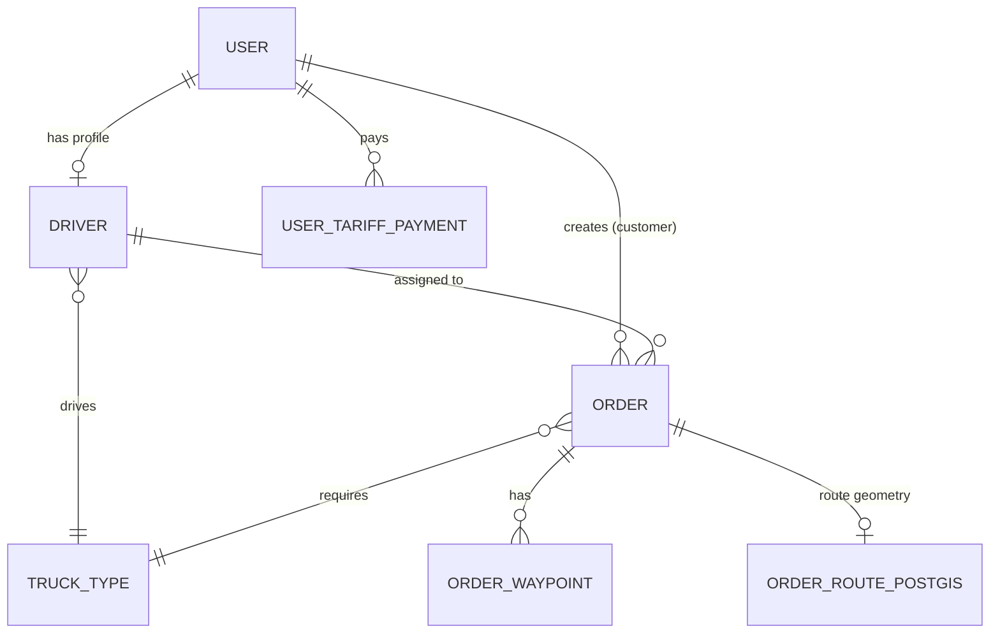

# Logistika Bot — Hozirgi Tizim Dizayni (As-Is)

> Holat: joriy kod bazasi asosida hujjatlashtirilgan (tavsiya emas — mavjud holat).
> Sana: 2026-07-17

---

## 1. Umumiy ko'rinish

Logistika Bot — O'zbekiston uchun mo'ljallangan yuk tashish platformasi. Uchta kirish nuqtasi bitta backend'ga ulanadi:

- **Telegram Bot** (aiogram) — asosiy foydalanuvchi interfeysi (ro'yxatdan o'tish, til tanlash, tasdiqlash kodlari).
- **Telegram Mini App / WebApp** — JWT bilan autentifikatsiya qilingan to'liq funksional kabinet (buyurtma, haydovchi profili, real-time GPS).
- **FastAPI REST/WebSocket API** — bot va WebApp ikkalasi ham shu backend'dan foydalanadi (kod va biznes-logika takrorlanmaydi).

```mermaid
flowchart LR
    TG["Telegram Client\n(Bot chat)"] -->|long polling| BOT["aiogram Bot\n(main.py)"]
    WEBAPP["Telegram Mini App\n(WebApp, JWT)"] -->|HTTPS + WS| API["FastAPI\n(config/main.py)"]
    BOT --> DB[(PostgreSQL + PostGIS)]
    API --> DB
    API --> REDIS[(Redis)]
    BOT -.notify.->|raw HTTP POST| TGAPI["Telegram Bot API"]
    API --> OSRM["OSRM Router\n(self-hosted)"]
    API --> GEMINI["Gemini API\n(google-genai)"]
```

---

## 2. Texnologik stek (joriy holat)

| Qatlam | Texnologiya | Fayl/Manba |
|---|---|---|
| Bot framework | aiogram 3.26 (async, long polling) | `main.py`, `handlers/bot.py` |
| Backend API | FastAPI + Uvicorn | `config/main.py` |
| ORM | SQLAlchemy 2.0 (async, `Mapped`/`mapped_column`) | `*/models.py` |
| DB driver | asyncpg | `config/config.py` |
| DB | PostgreSQL 15 + PostGIS 3.4 | `docker-compose.yml` (`postgis/postgis:15-3.4-alpine`) |
| Geo-kengaytma | GeoAlchemy2 + Shapely (`LINESTRING`, SRID 4326) | `order/models.py` (`OrderRoutePostGIS`) |
| Marshrut/masofa | OSRM (self-hosted, O'zbekiston `.osm.pbf`) | `docker-compose.yml` (`osrm/osrm-backend`) |
| Cache / Live GPS / Pub-Sub | Redis 7 (`redis.asyncio`) | `services/live_location.py` |
| Auth | JWT (python-jose) + bcrypt, Telegram WebApp `initData` tekshiruvi | `users/auth.py`, `users/telegram_auth.py` |
| AI | Google Gemini (`google-genai`), model `gemini-flash-latest` | `config/config.py`, `ai/` |
| Migratsiya vositasi | Alembic (o'rnatilgan, lekin **ishlatilmayapti**) | `alembic.ini`, `migrations/` |
| Konteynerizatsiya | Docker Compose (5 xizmat: db, redis, osrm, web, bot) | `docker-compose.yml` |
| Email/OTP | aiosmtplib | `.env.example` (`EMAIL_*`) |
| Fayl yuklash | aiofiles, local disk (`uploads/`, `StaticFiles`) | `driver/router.py`, `config/main.py` |

---

## 3. Servis arxitekturasi (Docker Compose)

5 ta konteyner, bitta `docker-compose.yml` ichida:

1. **`db`** — PostGIS bazasi, healthcheck bilan (`pg_isready`), boshqa xizmatlar shu healthy bo'lguncha kutadi.
2. **`logistika-redis`** — cache, live-location TTL kalitlari, pub/sub kanal (`driver_locations_channel`).
3. **`osrm`** — O'zbekiston xaritasi (`uzbekistan-260710.osm.pbf`) ustida `osrm-routed --algorithm mld`, `linux/amd64` platform majburiy (Apple Silicon uchun).
4. **`web`** — FastAPI, `uvicorn config.main:app`, port 8000.
5. **`bot`** — aiogram, `python main.py`, alohida process (`web`dan mustaqil, lekin bitta image/kod bazasi).

`web` va `bot` bir xil kod bazasini ishlatadi, lekin **alohida process** sifatida ishga tushadi — ikkalasi ham bitta PostgreSQL va Redis'ga ulanadi. Ular orasida to'g'ridan-to'g'ri chaqiruv yo'q; muloqot faqat DB orqali (bot yozgan ma'lumotni API o'qiydi) yoki Telegram Bot API orqali (`services/notifications.py` — API'dan botga emas, to'g'ridan-to'g'ri Telegram serveriga xabar yuboradi, `urllib` bilan sync so'rov, `asyncio.to_thread` orqali).

---

## 4. Modullar tuzilishi

| Modul | Vazifasi |
|---|---|
| `users/` | `User` modeli, JWT auth (`auth.py`), Telegram `initData` tekshiruvi (`telegram_auth.py`), tarif to'lovlari (`tariff_crud.py`, `tariff_router.py`) |
| `driver/` | `Driver`, `TruckType` modellari, profil CRUD, `/ws/location` WebSocket (live GPS) |
| `order/` | `Order`, `OrderWaypoint`, `OrderRoutePostGIS` modellari, schemas |
| `Admin_panel/` | Admin CRUD/router, `is_admin` ruxsat tekshiruvi |
| `ai/` | Gemini asosidagi suhbat (schemas hozircha bo'sh — asosiy logika boshqa joyda bo'lishi mumkin, `chat_ws` kompilyatsiya izi bor) |
| `handlers/` | aiogram handlerlari: `start.py`, `verification_code.py`, `bot.py` (Bot instansi) |
| `middlewares/` | `i18n.py` (til), `logging.py`, `error_handler.py` (FastAPI global xatolik handlerlari) |
| `services/` | `live_location.py` (Redis GPS), `notifications.py` (Telegram push), `datetime_utils.py` |
| `config/` | `config.py` (env/engine/AI sozlamalari), `main.py` (FastAPI app), `base.py`/`registry.py` (SQLAlchemy `Base`) |
| `utils/` | `geo.py`, `security.py`, `validation.py`, `db_types.py`, `admin_alerts.py` |
| `migrations/`, `scripts/` | Alembic skeleti (bo'sh), geo-seed skriptlari (`seed_uzbekistan_geo.py`) |

---

## 5. Ma'lumotlar modeli (joriy)



- **`User`** — `role` enum (`admin/sender/driver/guest/dispatcher/manager`), `balance`, `language`, ban holati.
- **`Driver`** — `truck_type_id`, joriy manzil **erkin matn** (`current_city`/`current_region` — `String`, FK emas), live-GPS holati (`is_live_location_active`, `live_location_expires`, `last_latitude/longitude`), `reliability_score` (`hybrid_property`: rating + on_time% + trip bonus − cancel penalty).
- **`Order`** — `status` enum (`SCHEDULED/PENDING/ACCEPTED/IN_PROGRESS/COMPLETED/CANCELLED`), bitta `driver_id` (nullable — hali tayinlanmagan bo'lishi mumkin), narx `price`/`currency`, `total_distance_km`.
- **`OrderWaypoint`** — bir nechta manzil nuqtasi (`PICKUP/DELIVERY/TRANSIT`), `sequence` bo'yicha tartiblangan, har birida holat (`PENDING/ARRIVED/COMPLETED/SKIPPED`).
- **`OrderRoutePostGIS`** — marshrut geometriyasi (`LINESTRING`, SRID 4326), `Order`ga 1:1.

**Muhim izoh:** eski marketplace/taklif (`order_offers`, `driver_announcements`) jadvallari kodda **mavjud emas** — `OrderStatus.PENDING` izohida ("haydovchi qidirilmoqda") ko'rinib turibdiki, model allaqachon avtomatik-tayinlash yo'nalishiga qarab yozilgan, lekin buni amalga oshiruvchi logika (matching/dispatch) hali yo'q.

---

## 6. Real-time va geo-oqim

- **Live GPS:** Driver WebApp/bot `/ws/location`ga ulanadi (`driver/router.py:204`) → JWT WS-token bilan autentifikatsiya (`?token=`) → har koordinata `services/live_location.update_driver_location()` orqali Redis'ga yoziladi (`driver_location:{id}`, TTL 1800s) va `driver_locations_channel`ga publish qilinadi.
- **Onlayn haydovchilar ro'yxati:** `get_all_online_drivers()` — `SCAN` (KEYS emas) bilan barcha `driver_location:*` kalitlarini terib, `MGET` bilan bir so'rovda o'qiydi.
- **Marshrut/narx hisoblash:** OSRM'ga so'rov (self-hosted, tashqi internet kerak emas) — masofa, taxminiy vaqt.
- **AI:** Gemini orqali (rol-asoslangan tizim ko'rsatmalari — `sender`/`driver`/`admin`/`guest` uchun alohida `ROLE_INSTRUCTIONS`, til direktivalari `uz`/`uz_cyrl`/`ru`).

---

## 7. Auth va xavfsizlik

- **JWT** — access/refresh token, `python-jose`, `bcrypt` parol hash.
- **Telegram WebApp** — `initData` imzosi tekshiriladi (`telegram_auth.py`).
- **CORS** — `allow_credentials=True` bilan `"*"` **ishlatilmaydi** (aniq origin ro'yxati, `CORS_ORIGINS` env orqali) — to'g'ri amalga oshirilgan.
- **Fayl yuklash** — kengaytma whitelist + 5MB hajm limiti (`driver/router.py:38`, DoS oldini olish uchun izoh bilan).
- **Admin** — `ADMIN` env'dagi Telegram ID ro'yxati + `role=admin`, `Admin_panel/validation.py` orqali tekshiriladi.

---

## 8. Joriy bo'shliqlar / texnik qarz (kuzatilgan)

Bu bo'lim faqat **kuzatuv** — tavsiyalar alohida faylda (`docs/TECH_RECOMMENDATIONS.md`).

- Schema `Base.metadata.create_all` orqali yaratiladi (`config/main.py:42`) — Alembic **o'rnatilgan, lekin haqiqiy migratsiya fayli yo'q** (`migrations/` bo'sh, faqat `env.py`/`README`).
- Avtomatik test suite yo'q — repo ichida faqat bitta qo'lda ishga tushiriladigan `test_ws.py` skripti bor, CI konfiguratsiyasi (`.github/workflows`) yo'q.
- `driver.current_region`/`current_city` erkin matn — FK emas (region/district bo'yicha aniq SQL filtrlash imkonsiz).
- Bot → foydalanuvchi bildirishnomasi `services/notifications.py`da aiogram Bot obyektidan foydalanmay, xom `urllib` bilan Telegram API'ga to'g'ridan-to'g'ri so'rov yuboradi (ishlaydi, lekin retry/rate-limit siyosati yo'q).
- Xatoliklarni kuzatish (Sentry va h.k.) yoki markazlashgan monitoring/metrika ko'rinmadi.
